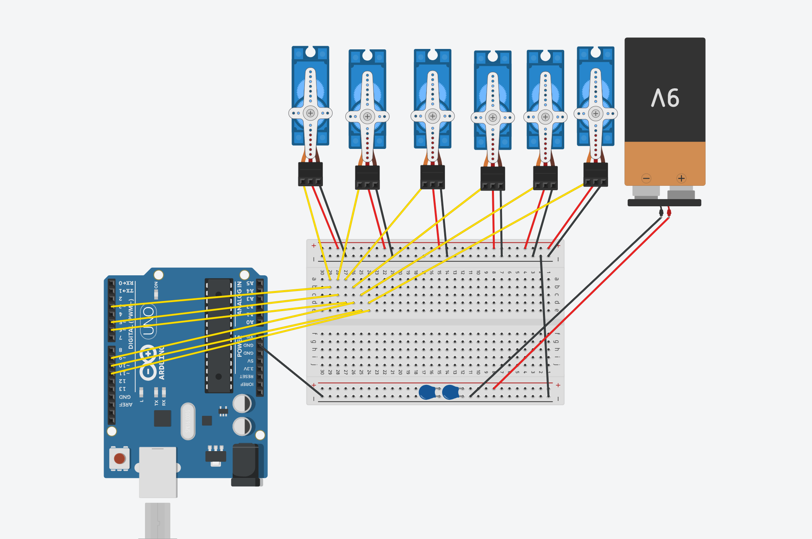

> **📖 Docs roadmap:** not sure what to read next? See the [Documentation Roadmap](README.md) — it gives the exact reading order for your goal.

# Hardware — Robot Assembly

> Hey, let's build the real arm! This guide walks you through the mechanical + wiring build step-by-step. No scary jargon — just "do this, then that."

**3D model & assembly guide:** [Robotic Arm with Servo & Arduino by Emre Kalem (@emrekalem)](https://makerworld.com/en/models/1134925-robotic-arm-with-servo-arduino?from=search#profileId-1135927) on MakerWorld (Standard Digital File License). Print at **0.2 mm, 3 walls, 20% infill, 4 plates** and follow the creator's build video + instructions for putting the printed parts together — the STLs here are adapted in `src/robot_arm_description/meshes/`, so we only cover the wiring tweaks below.

**You will need (BOM — this build):** 1× MG946R (base yaw), 2× MG995/MG996R (shoulder — paired, they rotate in opposite directions), 1× MG995/MG996R (elbow), 1× SG90 (wrist pitch), 1× SG90 (gripper), plus 1× SG90 (wrist roll — installed but fixed, not driven), Arduino Uno R3, ZK-4XX buck-boost (with display), LiPo battery, 608 bearing + 2× 6203 bearings, M3 screws (6/10/14 mm), jumper wires + servo extender wires, 2× perfboards, male/female headers, at least one 300 µF capacitor, and your printed parts. The top perfboard serves **5 servos** — everything except the base yaw. Full reference BOM + step-by-step assembly is on the [MakerWorld page](https://makerworld.com/en/models/1134925-robotic-arm-with-servo-arduino?from=search#profileId-1135927) — use that for the mechanical build, this doc is just your wiring companion.

**Quick pin reference (from `sketch/servo_bridge/servo_bridge.ino:36`):**

| Pin | Servo | Type | Where it lives |
|-----|-------|------|----------------|
| 3 | base yaw | MG946R | inside base, signal via male jumper inside |
| 5 | shoulder A | MG946R | top perfboard, male header |
| 6 | shoulder B | MG946R | top perfboard, male header — **moves opposite** to pin 5 (`RAD_TO_US -318`) |
| 9 | elbow | MG946R | top perfboard, male header |
| 10 | wrist pitch | SG90 | top perfboard, male header |
| 11 | gripper | SG90 | top perfboard, male header |
| — | wrist roll | SG90 | installed but **fixed** — no pin, no header needed |

---

## 1. Prepare the base

The base is your foundation — literally. Inside it sits the Arduino Uno R3, screwed down nice and snug.

**Steps:**

1. Print the base parts and clean supports.
2. Mount the **Arduino Uno R3 inside the base** using M3 screws through the mounting holes. Don't overtighten — snug is enough.
3. The **base yaw servo** (**MG946R** in this build) lives inside the base. Connect its **signal wire** to the Arduino with a **male-to-male jumper wire** (you'll route this inside). It stays on its own — it does *not* go through the top perfboard.
4. The base has two holes for cable routing:
   * **Top hole:** Wires for the *rest of the servos* (shoulder, elbow, wrist, gripper) come *out* here.
   * **Bottom hole:** The **Arduino GND + base yaw servo power wires** come *out* here toward the power board.

> **Tip:** Label your wires as you go — a little masking tape flag ("yaw", "shoulder", etc.) saves a lot of head-scratching later. For the mechanical steps, follow the creator's guide linked above — no extra photos needed here.

---

## 2. The little perfboard that brings it all together

This is the heart of the wiring — a small perfboard that acts like a neat junction box. No big PCB needed, just headers and a bit of solder.

**What it is:**

* **Male headers** — where all the servo connectors plug in (one per joint).
* **Female headers** — right next to them — where the Arduino *signal* wires arrive.
* **Power rails** — a straight soldered line that carries **+ and GND** along the board to every servo.

**How to build it:**

1. Take a small perfboard (about the size of your palm).
2. Solder a row of **male headers** (3 pins per servo: signal, +5V, GND) — spaced for servo connectors.
3. Right alongside each male header, solder a **female header** row.
4. Use **jumper-wire servo extenders** from the top hole — each servo's connector reaches this board. The **five servos** here are: 2× shoulder (they're paired but wired separately on the board — firmware drives them opposite), 1× elbow, 1× SG90 wrist, 1× SG90 gripper. (The SG90 wrist-roll is installed but fixed, no header needed.)
5. For **power**, solder a straight bus line across the board for + and another for GND, connecting the power pins of all male headers together.
6. Now the magic: for **signal**, just **bridge the adjacent pins** — the female header pin (Arduino side) bridged with solder to the neighboring male header's signal pin. That's it — Arduino signal → female header → solder bridge → male header → servo.
7. From the Arduino, run **male jumper wires** (signal only) to the female headers — one wire per servo (5 total). Power for those servos comes from the bus, not the Arduino.

```
Arduino (signal pin) --male jumper--> [female header] --solder bridge--> [male header] --> servo extender --> servo
Power (+/GND) --------> perfboard bus ----------------------------------> all servos
```

> **Friendly check:** Before powering anything, do a continuity test with a cheap multimeter — make sure signal bridges are connected but not shorted to power. It takes 30 seconds and prevents fried servos.

---

## 3. Power — the bottom board (or breadboard)

Power is where things get serious. Servos draw bursts of current, so we give them a solid, capacitor-backed supply.

**You have two options:**

* **Quick & easy:** a mini breadboard at the base.
* **Nicer:** solder a second **perfboard** at the bottom — more reliable for the long run.

**On that bottom board, connect:**

* **Power supply + and –** (your 5–6V rail).
* **Base yaw servo power** (the wires that came out the *bottom hole*).
* **Power wires of the top perfboard** (the small signal/power board you just built) — its +/GND buses feed from here.
* **At least 300 µF capacitance** across +/– (e.g., one 470 µF electrolytic). This smooths servo current spikes — don't skip it.

**In this build:**

* A **LiPo battery** → **ZK-4XX buck-boost converter** (the one with the built-in display — it shows live voltage/current and lets you dial in the output with adjustment knobs) → output wires → this bottom board.
* From there, power fans out to the MG946R yaw servo and up to the top perfboard bus. Perfect — you can watch the draw in real time.

```
LiPo ---(+ / -)--> ZK-4XX buck-boost ---(+ / -)--> [bottom perfboard/breadboard] --+--> yaw servo power (via bottom hole)
                                                         |  + 470uF cap
                                                         +--> top perfboard power bus --> all servos
```

> **Safety nudge:** Double-check polarity before plugging the LiPo. The ZK-4XX output should be set to **6V** (or your chosen servo voltage) *before* connecting servos. Measure with a multimeter first.

---

## 4. Rough circuit diagram (overview — not to scale)

> You're looking at the *big picture* here — just how everything plugs together. Think of this as a friendly sketch, not a PCB layout. Your perfboard build refines this.


*Rough overview: Arduino Uno on the left, breadboard in the middle, 6 servos + battery on the top-right, and two capacitors at the bottom. Yellow = signal, red/black = power. In your perfboard build, the breadboard becomes the two small perfboards described above.*

**Reading the sketch:**

* **Left — Arduino Uno R3:** Yellow wires out are your servo **signals**. One black wire is Arduino **GND** to the power bus (so everything shares a ground). The USB at the bottom is just how you flash `servo_bridge.ino`.
* **Middle — breadboard (stands in for your perfboards):** Top red rail = +, bottom blue/black = GND. Servos plug in at the top — red/black to power rails, yellow to a row that meets the Arduino signal wires. The two blue blobs at the bottom are your **≥300 µF capacitor(s)** across +/– (shown as two in parallel in the sketch — one 470 µF does the job too).
* **Top — servos:** Shown as 6, but in this build it's effectively **5 + 1 fixed**. The five active ones are the two shoulder servos (remember they move opposite), elbow, wrist (SG90), and gripper (SG90). The sixth/shown yaw (MG946R) is the one that actually lives inside the base and in your wiring comes via the bottom-hole power — here it just looks like another servo on the rail. The fixed wrist-roll SG90 isn't driven.
* **Right — battery / supply:** Labeled “9V” in the sketch, but in your build that's the **LiPo → ZK-4XX** block with its display and adjustment knobs. Its +/– go straight to the power rails/capacitor.

> **Friendly reminder:** This sketch is “rough” on purpose — it shows *connectivity*, not exact hole positions. Your perfboard refines the breadboard into soldered header rows + bridged signals, and the bottom board adds the ZK-4XX in place of the battery clip. As long as signal → signal, power → power, and GND is common everywhere, you're good!

## 5. Sanity checks before first power-on

* All signal bridges buzz with continuity, no short to +/GND.
* Bottom board cap is correctly oriented (electrolytic — stripe is negative).
* ZK-4XX output ~6V, no servos connected yet.
* Arduino is securely mounted, no screw touching a trace.
* Top-hole servo extenders have strain relief (a zip-tie so they don't pull the board).

---

## 6. Next steps

Once this is wired:

* Flash + bring up the ROS bridge — see [`04_HARDWARE_BRINGUP.md`](04_HARDWARE_BRINGUP.md) (pin map, calibration, `real_arm.launch.py`, MoveTo examples).
* Same `/modular_arm/move_to` API you used in sim drives the real arm.
* Firmware pin table & sketch reference: [`../sketch/servo_bridge/README.md`](../sketch/servo_bridge/README.md)
* Cameras (phone/ESP32) → [`07_CAMERA_BRIDGE.md`](07_CAMERA_BRIDGE.md) — needed for demos & policy.

---

## Credits

Mechanical design by **Emre Kalem (@emrekalem)** — [MakerWorld](https://makerworld.com/en/models/1134925-robotic-arm-with-servo-arduino?from=search#profileId-1135927) (Standard Digital File License). This assembly wiring is our build's adaptation for perfboard + ZK-4XX + Arduino Uno R3.
